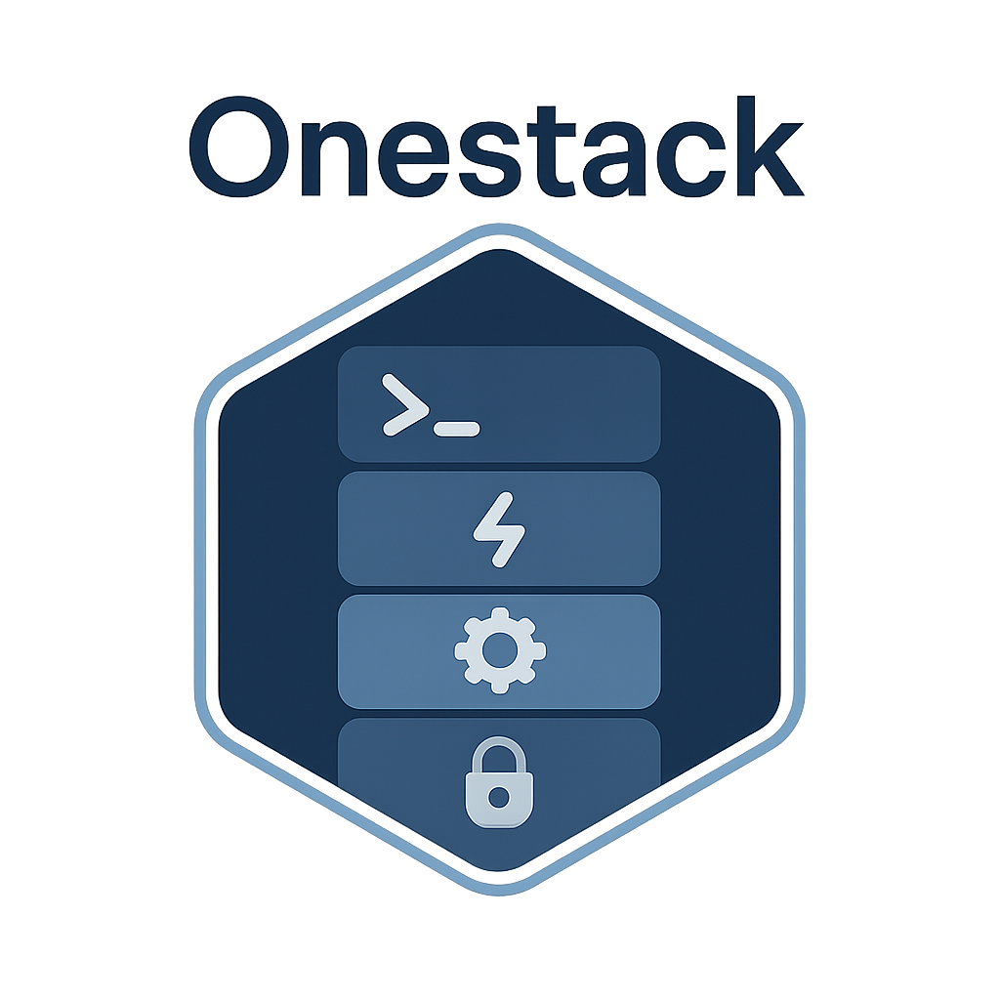

# My OneStack Server Setup!

This is the home for my personal OneStack deployment – a Docker-based infrastructure I use to run a bunch of self-hosted services. It's all neatly managed with automatic SSL, a reverse proxy, and more!

**GitHub Repository:** [https://github.com/madpin/onestack](https://github.com/madpin/onestack)

## 🚀 Welcome to My OneStack!

<div align="center">
  
</div>

Hey there! This isn't just any OneStack; it's *my* personal command center, a lovingly curated collection of self-hosted tools and services, all humming away on a rather beefy **Oracle Cloud ARM VPS**. We're talking **24GB of RAM** and **4 vCPUs** – plenty of juice to run all sorts of cool stuff!

**What's the Big Idea?**

I wanted a simple, reproducible, and fun way to manage my digital world. This OneStack setup, built on Docker, lets me:

- 🚀 **Launch new services in a snap:** Thanks to templating and some handy `Makefile` magic.
- 🔒 **Keep things secure:** With automatic SSL from Traefik and sensible network setups.
- 🛠️ **Tinker without fear:** Experimenting with new tools without (hopefully!) breaking the important stuff.
- 🌐 **Access my tools from anywhere:** Securely, of course!
- 🤓 **Learn and grow:** Because what's a home lab for if not for playing with new tech and figuring things out?

This repository is how I manage it all. It's a bit like my digital workshop, where I can spin up new tools, try out different configurations, and generally have a good time managing my own little corner of the internet.

**Think of this as a personal journey into self-hosting, and you're invited to peek behind the curtain!**

While the original OneStack provides a solid foundation for a production-ready Docker infrastructure, this version is tailored to my needs and experiments. It still benefits from core OneStack features like:

- Automatic SSL certificates via Let's Encrypt (thanks, Traefik!)
- Reverse proxying with automatic service discovery
- Centralized environment management (mostly DRY!)
- Internal and external network segregation
- Automated service management via `Makefile`

## 📋 Table of Contents

- [Quick Start](#-quick-start)
- [Makefile Commands](#-makefile-commands)
- [Creating New Services](#-creating-new-services)
- [Available Tools](#-available-tools)
- [Shared Services](#-services)
- [Traefik & Security](#-traefik--security)
- [Environment Configuration](#-environment-configuration)
- [Network Architecture](#-network-architecture)

## 🚀 Quick Start

1. **Clone and setup environment:**
   ```bash
   git clone https://github.com/madpin/onestack.git
   cd onestack
   cp .env.template .env
   # Edit .env with your actual values
   ```

2. **Create networks and start services:**
   ```bash
   make network  # Create Docker networks
   make up       # Start all services
   ```

3. **Check status:**
   ```bash
   make status   # View all service statuses
   make logs     # View logs from all services
   ```


## 🛠️ Makefile & onestack.sh Command Reference

Service management is handled via the Makefile, which wraps the central `bash/onestack.sh` script. All commands can be run via `make <target>` or by calling `bash/onestack.sh <action> [service] [options]` directly.

### Main Commands

- **`make help`**: Show all available commands and usage examples.

- **`make network`**: Create all Docker networks defined in `.env` files. Run this after changing network settings or before first startup.

- **`make up [service]`**: Start all services, or a specific `[service]` (e.g., `make up traefik`). Pulls/builds images and starts containers. Equivalent to `bash/onestack.sh up [service]`.

- **`make down [service]`**: Stop all services, or a specific `[service]`.

- **`make restart [service]`**: Restart all or a specific service (calls `down` then `up`).

- **`make update [service]`**: Pull the latest images for all or a specific service, without starting/stopping containers.

- **`make clean [ARGS=...]`**: Stop all services and clean up Docker resources. Options:
  - `--all-volumes`: Remove all unused Docker volumes (including named ones).
  - `--remove-dangling-images`: Remove dangling images only.
  - `--remove-images`: Remove all unused images.
  - Example: `make clean ARGS=--all-volumes`

- **`make logs [service] [ARGS=...]`**: Show logs for all or a specific service. `ARGS` are passed to `docker compose logs` (e.g., `-f`, `--tail 100`).
  - Example: `make logs traefik ARGS="-f --tail 50"`

- **`make logs-SERVICE [ARGS=...]`**: Shortcut to show logs for a specific service (e.g., `make logs-traefik ARGS=-f`).

- **`make logsf SERVICE`**: Shortcut to follow logs for a service (e.g., `make logsf homepage`).

- **`make status [service]`**: Show status of all or a specific service (container state, health, etc).

- **`make create-tool NAME=...`**: Scaffold a new tool (app) directory with templates.

- **`make create-shared NAME=...`**: Scaffold a new shared service (infra) directory with templates.

- **`make shell SERVICE=<name>`** or **`make shell-<service>`**: Open a shell in a running container for the given service.

- **`make restartf <service>`**: Restart a service and immediately follow its logs.

### Notes & Usage Tips

- `[service]` is the directory name (e.g., `traefik`, `homepage`, `shared/postgres`).
- `ARGS` lets you pass extra options to `docker compose` (e.g., log tailing, following, etc).
- To load environment variables into your current shell, use `source .env` or `source <service>/.env`.
- All commands can be run directly via `bash/onestack.sh <action> [service] [options]` for advanced usage.

#### Example Usages

```bash
# Start all services
make up

# Start only Traefik
make up traefik

# Stop all services
make down

# Restart homepage and follow logs
make restartf homepage

# Show logs for all services, follow last 100 lines
make logs ARGS="-f --tail 100"

# Open a shell in the ttrss container
make shell SERVICE=ttrss
```

## 🔧 Creating New Services

### Creating a New Tool

Tools are application services that provide specific functionality:

```bash
make create-tool NAME=grafana
```

This creates:
- `grafana/` directory with standard structure
- `grafana/docker-compose.yml` template
- `grafana/.env.template` and `grafana/.env` files
- `grafana/config/` and `grafana/data/` directories

### Creating a Shared Service

Shared services provide infrastructure components used by multiple tools:

```bash
make create-shared NAME=elasticsearch
```

This creates the same structure under `shared/elasticsearch/`

### Manual Service Configuration

After creation, you'll need to:

1. **Edit docker-compose.yml** to configure your service
2. **Update .env** with actual configuration values
3. **Add Traefik labels** for web exposure (if needed):
   ```yaml
   labels:
     - "traefik.enable=true"
     - "traefik.http.routers.myservice.rule=Host(`myservice.${BASE_DOMAIN}`)"
     - "traefik.http.routers.myservice.entrypoints=websecure"
     - "traefik.http.services.myservice.loadbalancer.server.port=8080"
   ```
4. **Configure networks**:
   ```yaml
   networks:
     - web                # For internet-facing services
     - internal_network   # For internal communication
   ```

## 🧰 What's Running in My Digital Playground?

This is where the magic happens! Here's a rundown of the cool tools and services I've got running on my Oracle Cloud VPS. Each one has its own little job to do, making my digital life smoother, more fun, or just more interesting.

### 📱 Main Web Services

| Service Icon | Name & Link | What it Does (for me!) | Internal Port | Tech Stack |
| :----------: | ----------- | ---------------------- | :-----------: | :--------- |
| � | **[Affine](affine.${BASE_DOMAIN})** | Collaborative workspace for docs, notes, and whiteboards | 3000 | TypeScript, Affine |
| 📚 | **[Calibre](calibre.${BASE_DOMAIN})** | Ebook library and web reader | 8083 | Python, Calibre-Web |
| 🗃️ | **[DBGate](dbgate.${BASE_DOMAIN})** | Multi-database management GUI | 3000 | Node.js |
| 📊 | **[Dozzle](dozzle.${BASE_DOMAIN})** | Real-time Docker log viewer | 8080 | Go, Vue.js |
| 📰 | **[FreshRSS](freshrss.${BASE_DOMAIN})** | RSS aggregator with full-text support | 80 | PHP, PostgreSQL |
| 🏠 | **[Homepage](homepage.${BASE_DOMAIN})** | Personal dashboard & service portal | 3000 | Next.js, YAML config |
| 🧠 | **[Karakeep](karakeep.${BASE_DOMAIN})** | AI-powered knowledge management | 3000 | Next.js, PostgreSQL, Chrome |
| 📈 | **[Langfuse](langfuse.${BASE_DOMAIN})** | LLM observability and analytics | 3000 | TypeScript, Next.js, ClickHouse |
| 💬 | **[LibreChat](librechat.${BASE_DOMAIN})** | Open-source ChatGPT alternative | 3080 | Node.js, MongoDB, Meilisearch |
| 🤖 | **[LiteLLM](litellm.${BASE_DOMAIN})** | Unified LLM API proxy | 4000 | Python, PostgreSQL, Redis |
| 🤩 | **[LobeChat](lobechat.${BASE_DOMAIN})** | Modern AI chat interface | 3210 | Next.js, PostgreSQL |
| 🔧 | **[n8n](n8n.${BASE_DOMAIN})** | Workflow automation platform | 5678 | Node.js, PostgreSQL |
| 📝 | **[Obsidian](obsidian.${BASE_DOMAIN})** | Web-based Obsidian notes | 3000 | Electron, Docker |
| 🖼️ | **[OpenWebUI](openwebui.${BASE_DOMAIN})** | Advanced LLM web interface | 8081 | Python, PostgreSQL, Redis |
| 🗂️ | **[Organizr](tabs.${BASE_DOMAIN})** | Service organization dashboard | 80 | PHP |
| 📄 | **[Paperless](paperless.${BASE_DOMAIN})** | Document management system | 8000 | Python, Django, PostgreSQL |
| 🤖 | **[Paperless-AI](paperless-ai.${BASE_DOMAIN})** | AI assistant for Paperless | 3000 | Python, AI integration |
| 📋 | **[Paperless-GPT](paperless-gpt.${BASE_DOMAIN})** | GPT-powered document OCR | 8080 | Python, OpenAI API |
| 🐳 | **[Portainer](portainer.${BASE_DOMAIN})** | Docker container management | 9000 | Go, Vue.js |
| 🌐 | **[RSSHub](rsshub.${BASE_DOMAIN})** | Universal RSS feed generator | 1200 | Node.js, Redis |
| 📝 | **[Scriberr](scriberr.${BASE_DOMAIN})** | AI transcription and summarization | 8080 | Python, PostgreSQL |
| 🕵️ | **[SearXNG](searxng.${BASE_DOMAIN})** | Privacy-focused metasearch engine | 8080 | Python |
| 📄 | **[Stirling PDF](stirling.${BASE_DOMAIN})** | Comprehensive PDF toolkit | 8080 | Java, Spring Boot |
| 🚪 | **[Traefik](traefik.${BASE_DOMAIN})** | Reverse proxy dashboard | 8080 | Go |
| 📰 | **[TTRSS](ttrss.${BASE_DOMAIN})** | Tiny Tiny RSS reader | 80 | PHP, PostgreSQL |
| 🔄 | **[Morss](morss.${BASE_DOMAIN})** | RSS feed enhancer | 8000 | Python |
| 🧪 | **[Whoami](whoami.${BASE_DOMAIN})** | Service testing endpoint | 80 | Go |
| 🔄 | **Watchtower** (No Web UI) | Automatic Docker container updates | N/A | Go |

### 🔧 Additional Service Components

Some services run multiple containers for enhanced functionality:

- **FreshRSS** includes `read`, `merc`, and `fivefilters` microservices for content extraction
- **Langfuse** runs both web and worker containers for scalability  
- **LibreChat** includes a separate RAG API for document processing
- **OpenWebUI** has a pipelines service for extended functionality
- **Paperless** ecosystem includes AI and GPT-powered enhancements
- **TTRSS** uses `mercury-parser-api` for full-text article extraction

**A Note on Dependencies:** Many of these tools rely on the "Shared Services" I describe below (like PostgreSQL, Redis, etc.). They work together to create a cohesive little ecosystem!

## 🏗️ The Unsung Heroes: Shared Backstage Crew!

Think of these as the hardworking backstage crew for my digital tools. They're the databases, caches, and other essential bits that many of the fun tools listed above need to function. They might not have flashy web UIs, but they're the backbone of this whole operation!

Here’s who’s in the crew:

-   💾 **PostgreSQL (`postgres:5432`):** My trusty relational database. It's like a super organized filing cabinet for structured data. Many apps use this, especially with the `pgvector` extension for cool AI-powered similarity searches!
-   📄 **MongoDB (`mongodb:27017`):** A flexible document database. Great for when data is less structured, like with chat logs or user profiles. LibreChat is a big fan of this one.
-   ⚡ **Redis (`redis:6379`):** An incredibly fast in-memory cache and message broker. It helps speed things up by keeping frequently accessed data ready to go in a flash and assists with background tasks.
-   🔎 **Meilisearch (`meilisearch:7700`):** A blazing-fast, typo-tolerant search engine. Makes finding things in apps like LibreChat a breeze.
-   🌐 **Headless Chrome (`chrome:9222`):** A full web browser, but without the visual interface. Karakeep uses this under the hood for things like web scraping and taking webpage snapshots.
-   📊 **ClickHouse (`clickhouse:8123`):** A super-fast columnar database built for analytics. If I ever need to crunch serious numbers or analyze large datasets from my tools, this is where it'll happen.
-   🕵️ **SearXNG (`searxng.${BASE_DOMAIN}`):** My own private, privacy-respecting metasearch engine. It aggregates results from many search providers without tracking me. Can be configured to be private or public.
-   🛡️ **Tailscale (VPN):** Not a database or cache, but a critical networking hero! It creates a secure, private network (a "tailnet") over the internet, making it easy and safe for my services to talk to each other, and for me to access them securely from anywhere.
-   🌐 **Browserless (`browserless:3000`):** Scalable Chrome-as-a-service for high-performance browser automation and web scraping.
-   📑 **Gotenberg (`gotenberg:3000`):** PDF generation microservice for document conversion and processing tasks.
-   🔍 **Tika (`tika:9998`):** Apache Tika document text extraction service. Used by Paperless for OCR and content parsing.
-   🗄️ **RcloneBKP:** Automated backup service using rclone for cloud storage synchronization and data protection.

### Quick Reference: Shared Service Details

This table gives a bit more technical detail on these core components:

| Service     | Default Internal Port | Key Purpose(s)                                  | Typical Docker Image (may vary)       |
| :---------- | :-------------------- | :---------------------------------------------- | :------------------------------------ |
| PostgreSQL  | 5432                  | Relational data storage, vector similarity      | `pgvector/pgvector:pg17`              |
| MongoDB     | 27017                 | Document data storage (NoSQL)                   | `mongo:8.0`                           |
| Redis       | 6379                  | Caching, session storage, message queuing       | `redis:alpine`                        |
| Meilisearch | 7700                  | Fast full-text search                           | `getmeili/meilisearch:v1.15`          |
| Chrome      | 9222                  | Headless web browsing, scraping, screenshots    | `gcr.io/zenika-hub/alpine-chrome:123` |
| ClickHouse  | 8123                  | High-performance analytical queries             | `clickhouse/clickhouse-server`        |
| SearXNG     | 8080 (internal)       | Private metasearch engine                       | `searxng/searxng`                     |
| Tailscale   | N/A (network layer)   | Secure private networking (VPN)                 | `tailscale/tailscale`                 |
| Browserless | 3000                  | Scalable Chrome-as-a-service                    | `ghcr.io/browserless/chromium`        |
| Gotenberg   | 3000                  | PDF generation and document conversion          | `gotenberg/gotenberg:8.20`            |
| Tika        | 9998                  | Document text extraction and OCR               | `apache/tika:latest`                  |
| RcloneBKP   | N/A (cron job)        | Automated cloud backup service                  | `madpin/rclone-backup:latest`         |

*(Internal ports are what services use to talk to each other. External access is usually via Traefik and a domain name, if applicable.)*

### A Bit More on Databases

-   **PostgreSQL:** This setup includes the `pgvector` extension, which is awesome for AI applications that need to find similar items based on "embeddings" (fancy math representations of data). Initialization scripts in `/docker-entrypoint-initdb.d` can pre-load schemas or data.
-   **MongoDB:** Configured for a single user that can access multiple databases (like `librechat` and a general `madpin` database). User creation is handled automatically by an init script.

These shared services are defined in the `shared/` directory. Each has its own `docker-compose.yml` and README, so check those out if you want to dive deeper into their specific configurations!

## 🔒 Traefik & Security

### How Traefik Works

Traefik acts as a reverse proxy and load balancer that:

1. **Automatically discovers services** via Docker labels
2. **Provides SSL termination** with Let's Encrypt certificates
3. **Routes traffic** based on hostname patterns
4. **Handles HTTP to HTTPS redirection**

### Service Exposure Configuration

To expose a service through Traefik, add these labels to your `docker-compose.yml`:

```yaml
labels:
  - "traefik.enable=true"
  - "traefik.http.routers.myservice.rule=Host(`myservice.${BASE_DOMAIN}`)"
  - "traefik.http.routers.myservice.entrypoints=websecure"
  - "traefik.http.services.myservice.loadbalancer.server.port=8080"

Here’s who’s in the crew:

-   💾 **PostgreSQL (`postgres:5432`):** My trusty relational database. Used by many apps, with `pgvector` for AI-powered similarity search.
-   📄 **MongoDB (`mongodb:27017`):** Flexible document database. Used by LibreChat and others.
-   ⚡ **Redis (`redis:6379`):** Fast in-memory cache and message broker. Used for caching, queues, and background tasks.
-   🔎 **Meilisearch (`meilisearch:7700`):** Blazing-fast search engine for full-text search in apps like LibreChat.
-   🌐 **Browserless/Chrome:** Headless browser automation for scraping, screenshots, and PDF generation. Used by tools like Gotenberg and for AI-powered web tasks.
-   📊 **ClickHouse (`clickhouse:8123`):** High-performance columnar database for analytics and event storage.
-   📄 **Gotenberg:** PDF generation and document conversion microservice.
-   🕵️ **SearXNG (`searxng.${BASE_DOMAIN}`):** Privacy-respecting metasearch engine, used for web search in LLMs and as a standalone search portal.
-   🗄️ **RcloneBKP:** Automated backups using rclone for cloud and local storage.
-   🦠 **Tika:** Document text extraction and metadata parsing for search and AI enrichment.
-   🦺 **Tailscale:** Secure mesh VPN for private networking between all my devices and servers.
   ```

2. **Add middleware labels:**
   ```yaml
   labels:
     - "traefik.http.routers.myservice.middlewares=myservice-auth"
     - "traefik.http.middlewares.myservice-auth.basicauth.users=user:$$2y$$10$$hash"
   ```

### Dashboard Protection

The Traefik dashboard is protected via:
- **Host rule:** Only accessible via `${BASE_DOMAIN}`
- **Basic auth:** Configured via `DASHBOARD_AUTH` in `traefik/.env`
- **Generate credentials:**
  ```bash
  htpasswd -nb admin "your-secure-password"
  ```

### SSL Certificates

- **Automatic issuance** via Let's Encrypt
- **HTTP Challenge** validation
- **Wildcard support** for subdomains
- **Certificate storage** in `traefik/data/acme.json`

## ⚙️ Environment Configuration

### Root Configuration (`.env`)

The main `.env` file contains global settings:

```bash
# Domain & SSL
BASE_DOMAIN=your-domain.com
ACME_EMAIL=your-email@example.com

# Networks
WEB_NETWORK_NAME=web
INTERNAL_NETWORK_NAME=onestack_internal_network

# User permissions
UID=1000
GID=1000

# Database credentials
POSTGRES_USER=your-postgres-username
POSTGRES_PASSWORD=your-postgres-password
MONGODB_ROOT_USER=root
MONGODB_ROOT_PASSWORD=your-mongodb-password
REDIS_PASSWORD=your-redis-password

# Service endpoints
MEILI_ADDR=http://meilisearch:7700
CHROME_ADDR=http://chrome:9222
```

### Service-Specific Configuration

Each service has its own `.env` file for service-specific settings:

- `traefik/.env` - Dashboard authentication
- `litellm/.env` - AI provider API keys and configuration
- `karakeep/.env` - Application-specific settings
- `shared/*/` - Infrastructure service settings

## 🌐 Network Architecture

### Network Topology

```
Internet
    ↓
[Traefik] (:80, :443)
    ↓
[web network] ← Internet-facing services
    ↓
[internal_network] ← Service-to-service communication
    ↓
[Individual Services]
```

### Network Types

1. **`web` Network:**
   - External network for internet-facing services
   - Traefik proxy network
   - Services exposed to the internet

2. **`internal_network` Network:**
   - Internal communication between services
   - Database connections
   - Service-to-service API calls

### Security Model

- **Default deny:** Services not explicitly exposed remain internal
- **Network isolation:** Internal services cannot be accessed directly
- **SSL termination:** All external traffic encrypted via Traefik
- **Access control:** Basic auth and custom middleware support

## ✍️ Author

This project is maintained by **madpin**.

- **Website:** [madpin.dev](https://madpin.dev)
- **GitHub:** [madpin](https://github.com/madpin)

## 🤝 Contributing

1. Follow the established directory structure
2. Include proper environment templates
3. Add Traefik labels for web services
4. Include health checks
5. Update this README with new services

---

**OneStack** - Simplifying self-hosted infrastructure management 🚀